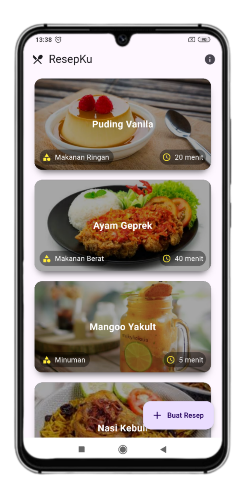
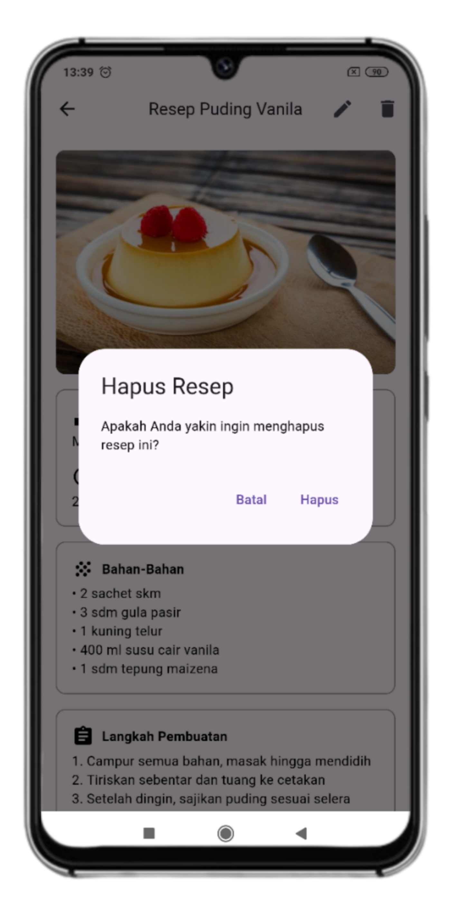
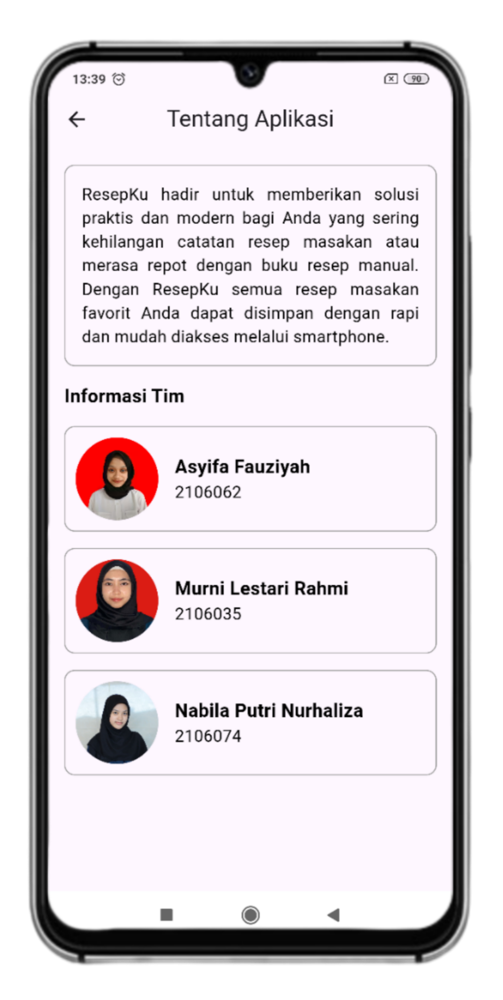
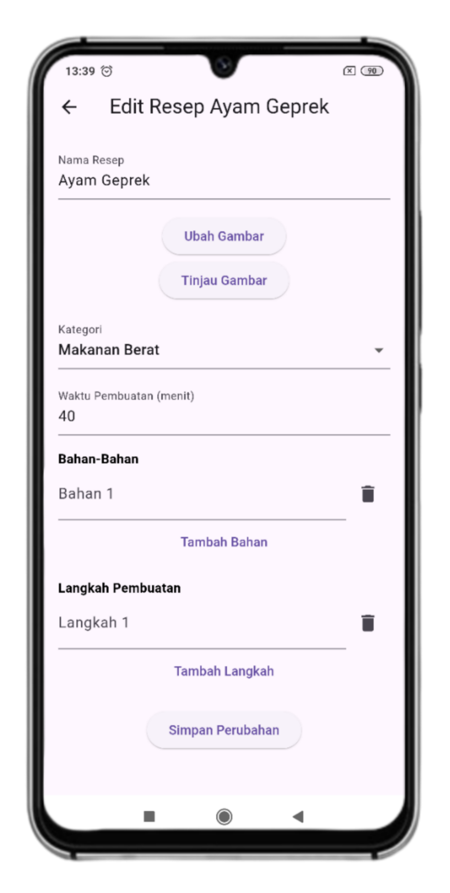

# ResepKu AppMobile

ResepKu adalah aplikasi pencatat resep yang memungkinkan pengguna untuk membuat, mengedit, dan menghapus resep mereka. Aplikasi ini menggunakan penyimpanan lokal Flutter dengan sqflite untuk menyimpan dan mengambil data resep secara lokal di perangkat.

## Features

- **Buat Resep Baru**: Pengguna dapat membuat resep baru dengan judul dan isi.
- **Edit Resep**: Pengguna dapat mengedit resep yang sudah ada.
- **Hapus Resep**: Pengguna dapat menghapus resep yang tidak lagi diperlukan.
- **Lihat Detail Resep**: Pengguna dapat melihat detail lengkap dari setiap resep.

## Technologies Used

### Frontend

- **Dart**: The main programming language used for developing this application.
- **Flutter**: A framework for building responsive and attractive user interfaces.

### Dependencies

- **flutter**: SDK Flutter untuk pengembangan aplikasi.
- **cupertino_icons**: Versi 1.0.6, untuk ikon gaya Cupertino.
- **image_picker**: Versi 1.1.2, untuk mengambil gambar dari galeri atau kamera.
- **shared_preferences**: Versi 2.2.3, untuk menyimpan data sederhana secara lokal.

### Dev Dependencies

- **flutter_test**: SDK Flutter untuk pengujian aplikasi.
- **flutter_lints**: Versi 3.0.0, untuk mengaktifkan serangkaian linting yang direkomendasikan guna mendorong praktik pengkodean yang baik.

## Installation

1. **Clone this Repository**

   ```bash
   git clone https://github.com/MurniLestariRahmi/MobileApp_Resepku.git
   cd resepkumobileapp
   ```

2. **Install Dependencies**

   ```bash
   flutter pub get
   ```

3. **Run the Application**
   ```bash
   flutter run
   ```

## License

This application is licensed under the MIT License. See the [LICENSE](LICENSE) file for more information.

## Project Thumbnail

<p float="left">
    
    &nbsp;&nbsp;
    
    &nbsp;&nbsp;
    
    &nbsp;&nbsp;
    
    &nbsp;&nbsp;
    
    &nbsp;&nbsp;
    
</p>
